# Note Blog

一个前后端分离的**智能笔记与知识库系统**，集成了 RAG 检索增强生成、多协议 AI 对话、共享知识库协作，以及 AI 驱动的安全分析模块。

---

## 目录

- [功能概览](#功能概览)
- [技术栈](#技术栈)
- [项目结构](#项目结构)
- [架构设计](#架构设计)
- [本地开发](#本地开发)
- [Docker 部署](#docker-部署)
- [环境变量](#环境变量)
- [API 文档](#api-文档)
- [截图](#截图)

---

## 功能概览

### 📒 个人笔记

- 笔记本与笔记的创建、编辑、删除
- 笔记置顶、标签分类、自动保存
- Markdown 实时预览编辑
- 笔记 Markdown 导入 / 导出
- AI 格式优化（异步任务，带进度追踪）
- 字数统计、浏览量记录

### 📝 公开博客

- 博客文章的发布、编辑、删除
- 分类目录与标签体系
- 公开博客首页与详情页
- 后台管理面板（角色权限控制）

### 🧠 AI 知识库 (RAG)

- 文档上传与自动解析（PDF、DOC、DOCX、TXT、MD）
- 文档智能分块与向量化（1024 维 pgvector 嵌入）
- 流式 AI 对话（SSE + 平滑速率控制）
- **自适应检索路由**：摘要优先 / 混合检索 / 关键词检索 / 纯向量检索
- **三种回答模式**：严格知识库 / 混合推理 / 自由对话
- 分类过滤检索、元数据溯源
- AI 模型配置热更新（无需重启）

### 👥 共享知识库

- 创建与管理共享知识库
- 成员邀请与权限控制（创建者 / 管理员 / 成员）
- 公开「广场」浏览与发现
- 密码保护的知识库访问
- 从个人知识库复制文件到共享知识库
- 知识库范围内 AI 对话

### 🔐 AI 安全分析（扩展模块）

- **APK 逆向分析**：反编译 + AI 增强分析（行为、权限、网络、敏感 API）
- **SO / ELF 分析**：二进制安全检测 + AI 辅助解读
- **协议分析**：网络协议逆向与 AI 解读
- **沙箱分析**：基于 Docker Android 模拟器的动态行为分析
- **Prompt 注入检测**：AI 提示词安全性分析
- 分析历史记录追踪

### 👤 用户系统

- 手机号注册（验证码）
- 角色权限体系（管理员 / 普通用户）
- 邀请码机制（可开启 / 关闭）
- 个人信息修改、密码修改

---

## 技术栈

### 前端

| 类别 | 技术 |
|------|------|
| 框架 | Vue 3（Composition API） |
| 构建工具 | Vite 4 |
| UI 组件库 | Element Plus 2 |
| 状态管理 | Pinia 2 |
| 路由 | Vue Router 4 |
| HTTP 客户端 | Axios |
| Markdown 编辑器 | @kangc/v-md-editor + Prism 语法高亮 |
| 安全过滤 | DOMPurify |

### 后端

| 类别 | 技术 |
|------|------|
| 语言 | Java 17 |
| 框架 | Spring Boot 3.5 |
| ORM | MyBatis-Plus 3.5 |
| 认证鉴权 | Sa-Token（JWT + Redis） |
| 数据库 | PostgreSQL + pgvector 向量扩展 |
| 缓存 | Redis |
| 数据库迁移 | Flyway |
| AI 框架 | LangChain4j 1.0 |
| AI 协议支持 | OpenAI 兼容 / Anthropic / Gemini / Ollama |
| 文档解析 | Apache Tika + PDFBox + Flexmark |
| 文件存储 | x-file-storage (dromara) |
| PDF 生成 | iText (html2pdf) |
| 工具库 | HuTool、Lombok |
| 响应式 | WebFlux（AI 流式对话） |
| 安全分析 | APKParser + dexlib2 + jelf |

### 部署

| 类别 | 技术 |
|------|------|
| 容器化 | Docker Compose |
| 反向代理 | Nginx |
| 构建 | Multi-stage Dockerfile（源码编译） |
| 沙箱 | budtmo/docker-android |

---

## 项目结构

```
note_dev/
├── docker/                                  # Docker 部署相关
│   ├── docker-compose.example.yml           # Compose 编排模板
│   ├── Dockerfile.backend                   # 后端多阶段构建
│   ├── Dockerfile.frontend                  # 前端多阶段构建
│   ├── nginx/default.conf                   # Nginx 反向代理配置
│   └── config/application-docker.example.yml # 容器环境配置模板
│
├── initialization-note-side/                # Spring Boot 后端
│   └── src/main/
│       ├── java/com/aezer0/initialization/
│       │   ├── config/                      # 配置（AI / 认证 / 线程池 / 异常）
│       │   │   └── ai/                      # pgvector / 内容检索器配置
│       │   ├── controller/                  # REST 控制器
│       │   ├── service/                     # 业务逻辑
│       │   │   └── ai/                      # AI 对话 / 向量 / 文档 / 检索路由
│       │   │       ├── adapter/             # 动态模型调度
│       │   │       └── protocol/            # 多协议适配 (OpenAI/Anthropic/Gemini)
│       │   ├── mapper/                      # MyBatis-Plus Mapper
│       │   ├── domain/                      # 实体类
│       │   ├── dto/                         # 数据传输对象
│       │   ├── vo/                          # 视图对象
│       │   ├── enums/                       # 枚举
│       │   ├── utils/                       # 工具类
│       │   └── result/                      # 统一响应封装
│       └── resources/
│           ├── db/migration/                # Flyway 迁移脚本 (V1~V11)
│           └── application.example.yml      # 本地配置模板
│
├── note-front/                              # Vue 3 前端
│   └── src/
│       ├── api/                             # API 接口封装 (按模块拆分)
│       ├── components/                      # 公共组件
│       │   └── ai-security/                 # AI 安全分析子组件
│       ├── composables/                     # 组合式函数
│       ├── router/                          # 路由配置
│       ├── store/                           # Pinia 状态管理
│       ├── utils/                           # 工具函数 (Markdown / Chat / AI 解析)
│       └── views/                           # 页面视图
│
├── imges_example/                           # 示例截图
├── sql_init.sql                             # 历史初始 SQL
└── sql_upgrade.sql                          # 历史升级 SQL
```

---

## 架构设计

### 混合检索架构 (Hybrid RAG)

```
用户提问
    │
    ▼
┌──────────────────────────────────────┐
│         自适应检索路由规划器           │
│  (KnowledgeRetrievalRouterService)   │
│                                      │
│  分析问题 → 选择策略:                  │
│  • 摘要优先 (Summary-First)           │
│  • 混合检索 (Hybrid: 向量+关键词)      │
│  • 关键词检索 (Keyword)               │
│  • 纯向量检索 (Vector)                │
└──────────────────────────────────────┘
    │
    ▼
┌──────────────────────────────────────┐
│           结构化约束层                 │
│                                      │
│  • 知识库边界 (个人/共享)              │
│  • 成员权限过滤                       │
│  • 分类归档范围                       │
│  • 文件来源溯源                       │
└──────────────────────────────────────┘
    │
    ▼
┌──────────────────────────────────────┐
│         pgvector 向量召回             │
│  1024-dim embedding                  │
│  语义相似度 + 结构化过滤              │
└──────────────────────────────────────┘
    │
    ▼
┌──────────────────────────────────────┐
│        LLM 增强生成 + 源引用          │
│  流式 SSE 输出 + 自适应速率控制       │
└──────────────────────────────────────┘
```

设计理念：
- **不是纯向量相似度搜索**：叠加了分类归属、共享范围、文件来源、成员关系等结构化条件，先缩小搜索空间再做召回
- **不是重型知识图谱**：轻量吸收 LLMWiki 的知识组织思路，笔记 / 文档 / 博客 / 共享知识库组合成可持续维护的知识单元
- **可解释性强**：知识命中路径可回溯到文档分类、知识库范围、文件归档和业务上下文

### AI 多协议适配

```
DynamicChatDispatcher
    │
    ├── OpenAI 兼容协议 → DashScope / Qwen / 任意兼容服务
    ├── Anthropic 协议   → Claude 系列模型
    ├── Gemini 协议      → Google Gemini
    └── Ollama 本地      → 本地部署的开源模型
```

---

## 本地开发

### 前置条件

- Java 17+
- Maven 3.8+
- Node.js 18+
- PostgreSQL（推荐带 pgvector 扩展）
- Redis 7+

### 1. 准备配置文件

从模板复制各环境的配置文件，替换占位值为真实配置：

```bash
# 后端本地配置
cp initialization-note-side/src/main/resources/application.example.yml \
   initialization-note-side/src/main/resources/application.yml

# Docker 环境配置
cp docker/config/application-docker.example.yml docker/config/application-docker.yml
cp docker/docker-compose.example.yml docker/docker-compose.yml
cp docker/.env.example docker/.env

# 前端环境变量
cp note-front/.env.example note-front/.env.local
```

配置文件中的占位值（需替换）：

| 占位值 | 说明 |
|--------|------|
| `git_upload_db_password` | 数据库密码 |
| `git_upload_redis_password` | Redis 密码 |
| `git_upload_jwt_secret` | JWT 签名密钥 |
| `sk-xxxxxx` | AI 模型 API Key |

### 2. 启动基础依赖

确保 PostgreSQL 和 Redis 已运行，默认端口：

| 服务 | 端口 |
|------|------|
| 后端 API | `8889` |
| 前端开发 | `3001` |
| PostgreSQL | `5434` |
| Redis | `6379` |

### 3. 启动后端

```bash
mvn -f initialization-note-side/pom.xml spring-boot:run
```

Flyway 会在启动时自动执行数据库迁移，无需手动执行 SQL。

### 4. 启动前端

```bash
cd note-front
npm install
npm run dev
```

前端开发服务器将运行在 `http://localhost:3001`。

---

## Docker 部署

Dockerfile 采用多阶段构建，**直接从源码编译**，无需预先构建 target 或 dist 目录。

### 1. 准备配置

```bash
cp docker/docker-compose.example.yml docker/docker-compose.yml
cp docker/.env.example docker/.env
cp docker/config/application-docker.example.yml docker/config/application-docker.yml
```

编辑 `.env` 文件，填入真实环境变量。

### 2. 一键启动

```bash
cd docker
docker compose up --build -d
```

服务组成：

| 服务 | 说明 | 端口 |
|------|------|------|
| postgres | PostgreSQL + pgvector | `5434` |
| redis | Redis 7 | `6379` |
| backend | Spring Boot API | `8889` |
| frontend | Vue 静态资源构建 | — |
| nginx | 反向代理 + 静态文件服务 | `3001` |

### 3. 访问

- 前端页面：`http://127.0.0.1:3001`
- 后端 API：`http://127.0.0.1:8889`

---

## 环境变量

部署时需要配置的环境变量（通过 `.env` 文件或系统环境变量注入）：

| 变量 | 说明 | 示例 |
|------|------|------|
| `DB_HOST` | 数据库地址 | `postgres` |
| `DB_PORT` | 数据库端口 | `5432` |
| `DB_NAME` | 数据库名 | `note_blog` |
| `DB_USERNAME` | 数据库用户 | `postgres` |
| `DB_PASSWORD` | 数据库密码 | `your_password` |
| `REDIS_HOST` | Redis 地址 | `redis` |
| `REDIS_PORT` | Redis 端口 | `6379` |
| `REDIS_PASSWORD` | Redis 密码 | `your_redis_password` |
| `JWT_SECRET` | JWT 签名密钥 | `your_jwt_secret` |
| `AI_BASE_URL` | AI API 地址 | `https://dashscope.aliyuncs.com/compatible-mode/v1` |
| `AI_API_KEY` | AI API Key | `sk-xxxxxxxx` |
| `AI_CHAT_MODEL` | 对话模型名 | `qwen-plus` |
| `AI_EMBEDDING_MODEL` | 嵌入模型名 | `text-embedding-v3` |
| `FILE_DOMAIN` | 文件访问域名 | `http://127.0.0.1:8889/file/` |
| `STORAGE_PATH` | 文件存储路径 | `/app/uploads` |
| `NGINX_EXPOSE_PORT` | Nginx 对外端口 | `3001` |

---

## API 文档

完整接口文档见 [note-front/inteface.md](note-front/inteface.md)，涵盖以下模块：

- 用户认证（注册 / 登录 / 验证码 / 用户信息）
- 笔记本与笔记 CRUD
- 博客文章与分类标签
- 文档上传与管理
- AI 流式对话（个人知识库 + 共享知识库）
- 共享知识库与成员管理
- AI 模型配置管理
- AI 安全分析（APK / SO / 协议 / Prompt 注入）

---

## 截图

### 博客主页
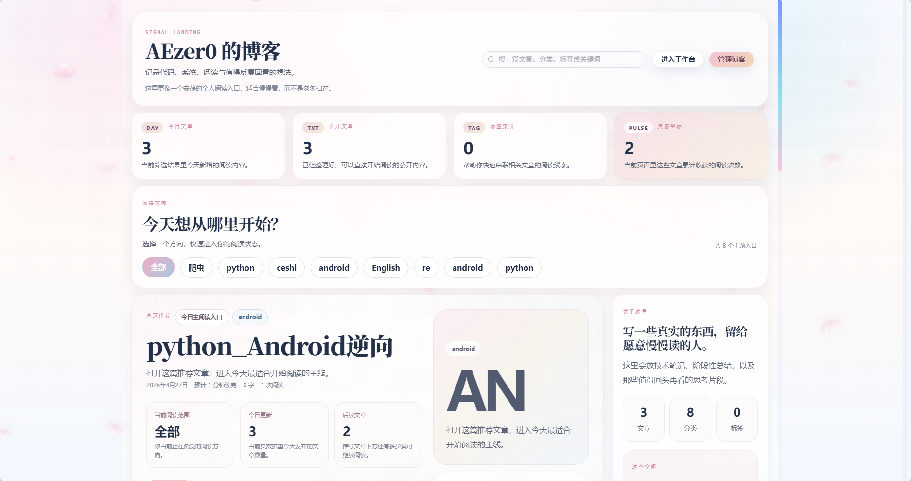

### 笔记本主页
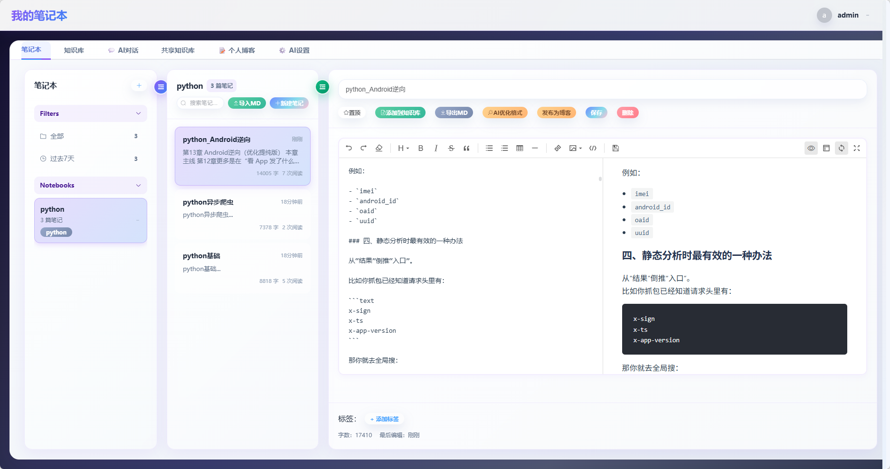

### 知识库管理
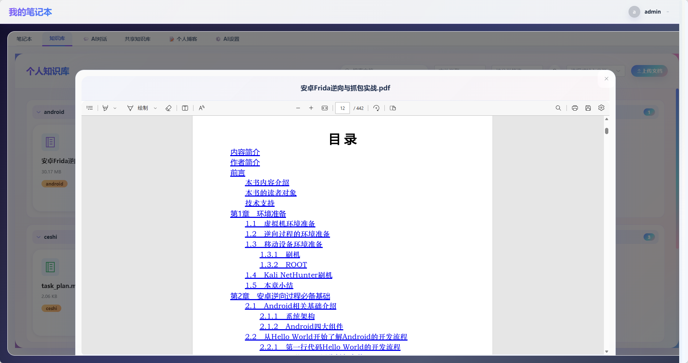

### AI对话
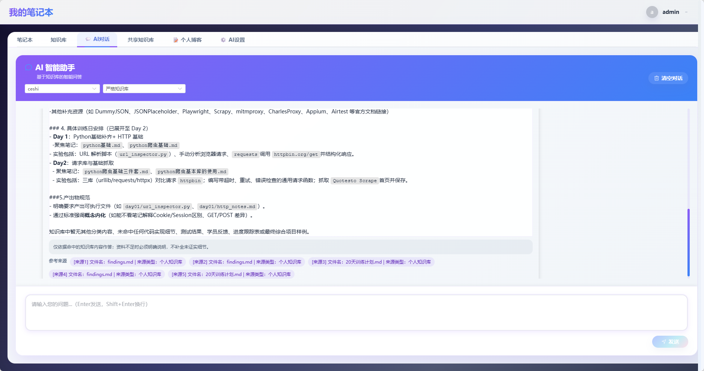

### 共享知识库
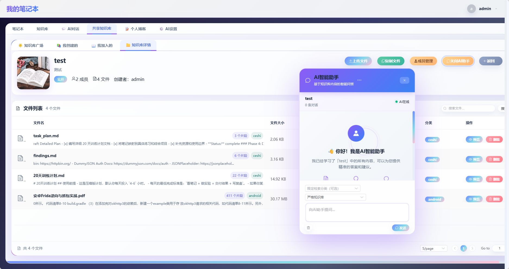

### 博客管理
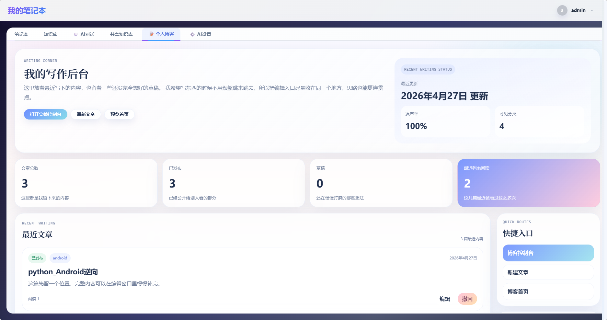

### AI配置
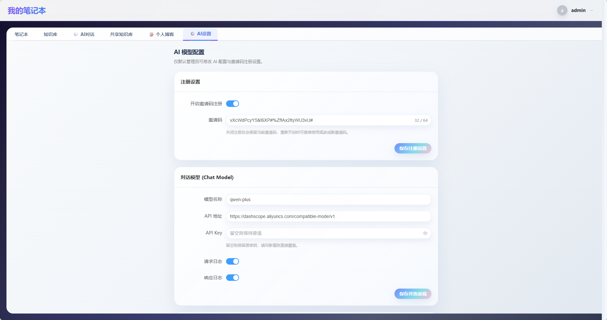

### AI安全分析-Prompt注入检测

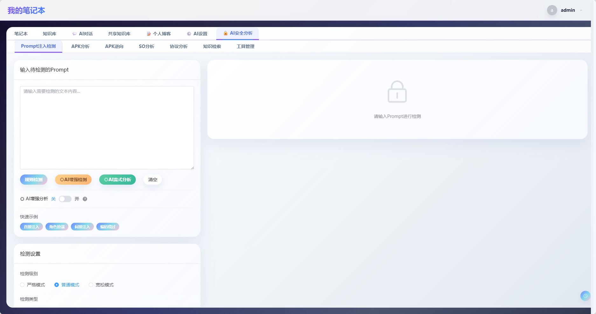

### AI安全分析-APK分析

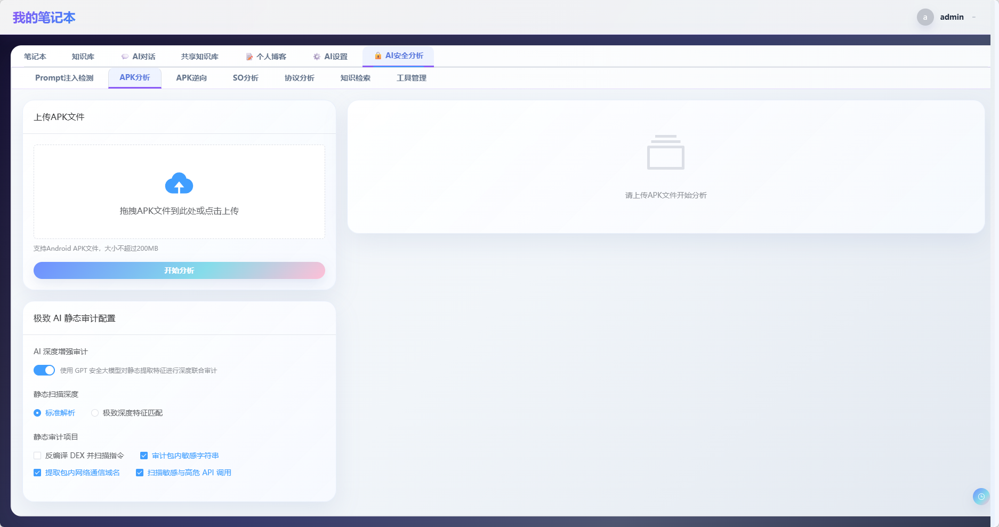

### AI安全分析-APK逆向

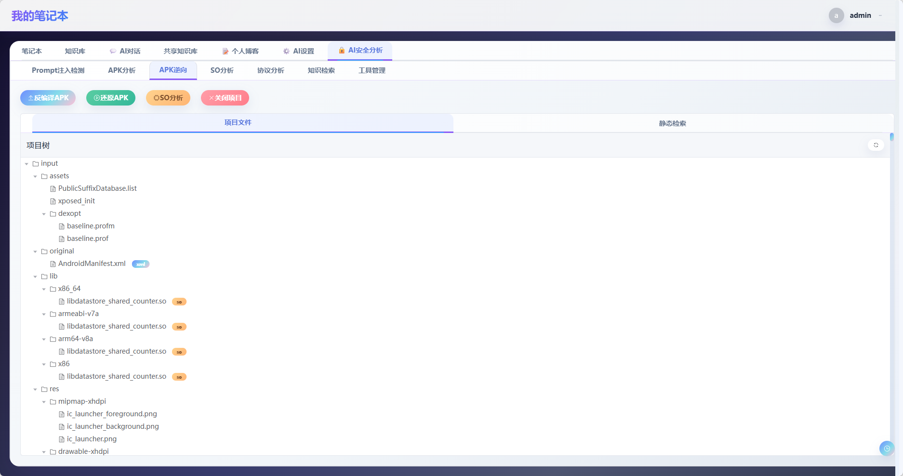

### AI安全分析-SO分析

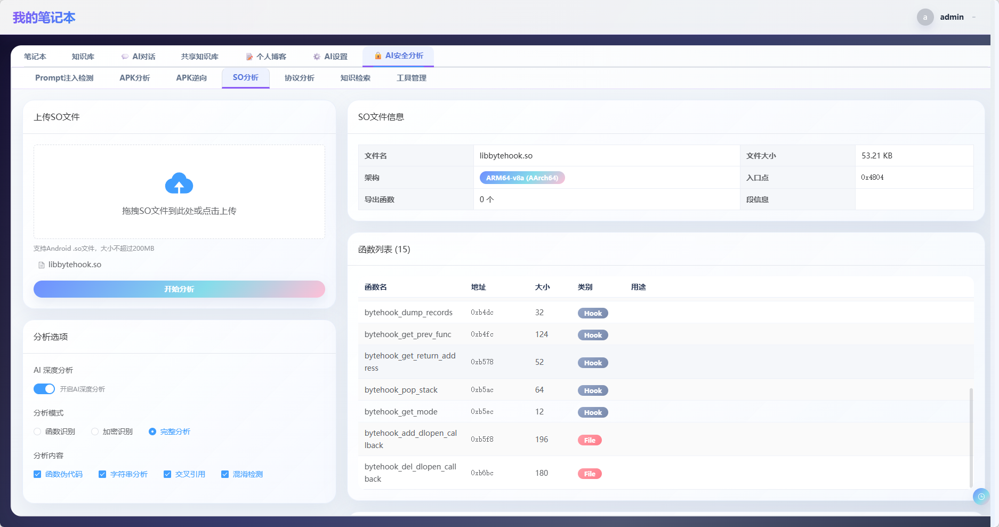

### AI安全分析-协议分析

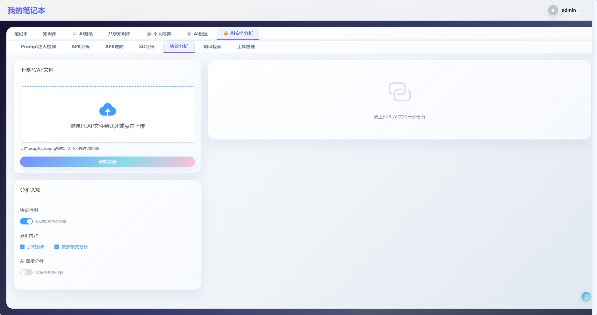

</details>
